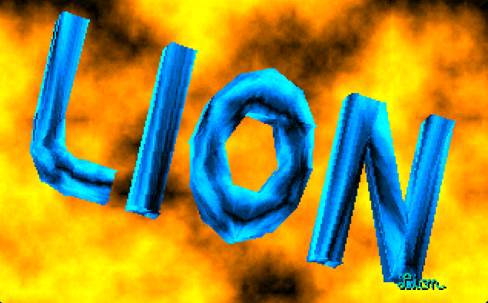
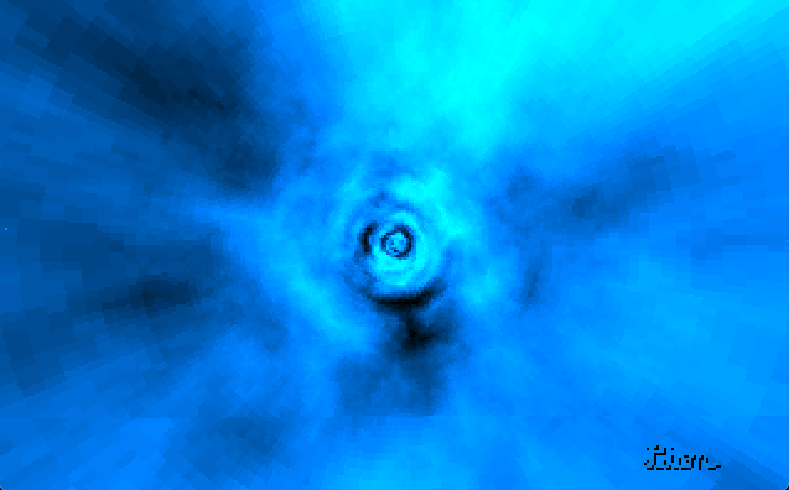
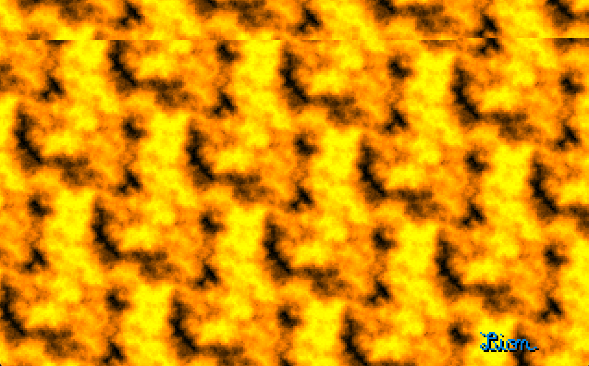

THE 4Kb intro by Elliot - 1995

Notes
- Lion finished first at the Wired 1995 in the 4KB category
- you can run this on modern hardware/operating-systems with dosbox (among others).
- you can press the escape key to move to the next sequence

https://files.scene.org/view/parties/1995/wired95/results.txt
https://files.scene.org/view/parties/1995/wired95/in4k/ep-lion.zip

